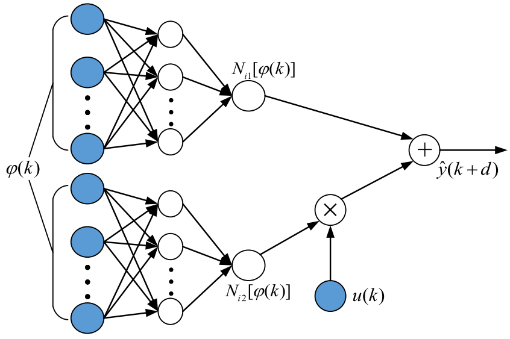

# Data‐driven identification and control of nonlinear systems using multiple NARMA‐L2 models
This repository provides homemade C++ code for a fixed-structure feedforward neural network to identify (approximate) a NARMA-L2 model using experimental input-output data. MATLAB wrappers for the C++ implementation are also provided to enable easy use of the network in MATLAB.  For more details about NARMA model, NARMA-L2 model, and multiple NARMA-L2 model based control, please refer to our paper [Data‐driven identification and control of nonlinear systems using multiple NARMA‐L2 models](https://onlinelibrary.wiley.com/doi/abs/10.1002/rnc.3818). Th network structure for a NARMA-L2 model is shown below.

## Features

This neural network is coded in C++ from scratch instead of depending on existent libraries, such as MATLAB neural network toolbox or *TensorFlow*, to make it a light-weighted, and self-contained tool specially designed for NARMA-L2 model identification and control. 
- This implementation is very efficient due to full vectorization by using the [Eigen](http://eigen.tuxfamily.org/index.php?title=Main_Page) linear algebra library.
- The batch size for network training can be specified arbitrarily to support both offline (batch) learning and online (incremental) learning.
- The hidden layer supports both ReLU and Tanh activations.
- Training supports naive gradient descent and gradient descent with momentum. 
- We provide a MATLAB wrapper for the NARMA-L2 network in an object-oriented manner, which is straightforward to be used in MATLAB programs, especially for those from the control community.
- If the MATLAB Parallel Computing Toolbox is available, the training process of multiple NARMA-L2 models can be parallelized onto multiple cores of the CPU to further improve its efficiency.

## How to use
## Reference
Yang, Yue, Cheng Xiang, Shuhua Gao, and Tong Heng Lee. "Data‐driven identification and control of nonlinear systems using multiple NARMA‐L2 models." International Journal of Robust and Nonlinear Control 28, no. 12 (2018): 3806-3833.